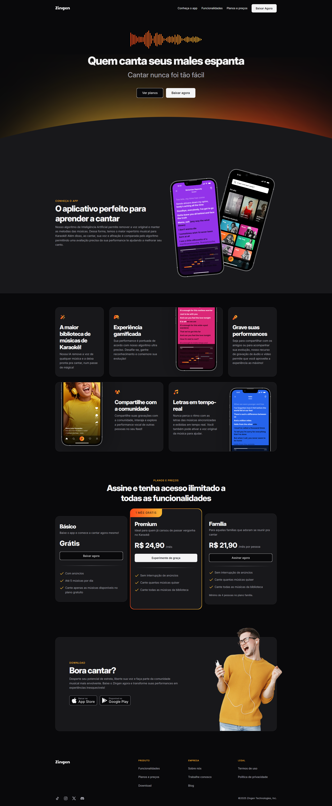

# Zingen



## 🌍 Sobre o projeto

O **Zingen** é um aplicativo inovador criado para ajudar os usuários a aprenderem a cantar de maneira divertida e eficaz. Usando tecnologia de inteligência artificial, o Zingen remove a voz original das músicas e permite que você pratique suas habilidades vocais com uma variedade de recursos interativos.

----------

## 🌟 Funcionalidades principais

-   🎶 **Biblioteca de músicas de Karaokê**: Acesse uma vasta seleção de músicas e cante suas favoritas.
    
-   🎮 **Experiência gamificada**: Melhore seu desempenho e acompanhe sua evolução com feedback em tempo real.
    
-   🎤 **Gravação de performances**: Grave suas sessões e compartilhe com amigos e familiares.
    
-   👤 **Comunidade**: Compartilhe suas gravações com outros usuários e inspire-se nas performances de outras pessoas.
    
-   🕒 **Letras em tempo real**: Acompanhe as letras das músicas sincronizadas enquanto canta.

----------

## 📊 Tecnologias utilizadas

O projeto foi desenvolvido utilizando as seguintes tecnologias para garantir uma experiência ágil e responsiva:

-   **HTML**: Estrutura semântica e conteúdo do site.
    
-   **CSS**: Estilização visual e layout do site.

----------

## 🔧 Como rodar o projeto

Para executar o Zingen localmente, siga os passos abaixo:

1.  **Clone o repositório**:
    
    ```
    git clone https://github.com/seu-usuario/zingen.git
    cd zingen
    ```
    
2.  **Abra o arquivo HTML**:
    
    Abra o arquivo `index.html` em seu navegador para visualizar o projeto.

----------

Aproveite a jornada musical com o Zingen e dê asas ao seu talento vocal!

